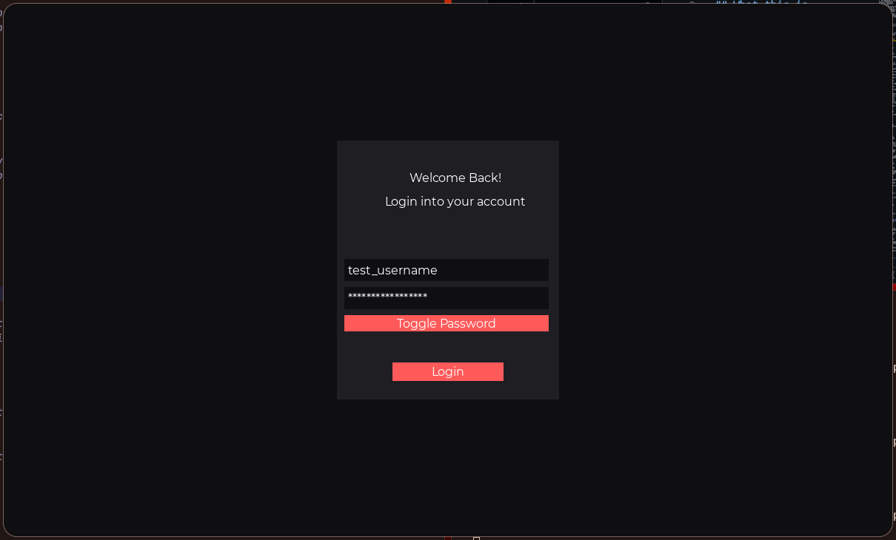

# Simple Login Form Showcase

## What this is

This project is a small but complete example built using **[SXUI](https://github.com/SwirX/SXUI)**, a UI library written in C.

The goal of this showcase is not authentication or security.
The goal is to show how a UI application is structured in plain C using real concepts such as state, callbacks, flags, and an event loop.

<details>
<summary>Quick visual:</summary>
<details>
<summary>Password Hidden</summary>


</details>
<details>
<summary>Password Revealed</summary>


</details>
</details>

If you are new to C, this project is meant to teach.
If you are experienced, it is meant to be readable and honest.

> This README is intentionally detailed.
> It explains both SXUI concepts and the C language features used in this example.

**Recommended way to use this example:**

1. Read the detailed comments directly in [`main.c`](./main.c) — they explain the high-level structure and decisions
2. If something is still unclear (especially C-specific details), continue here
3. Read the sections in order — they build on each other from basic to more advanced concepts

**How to build & run**  
All showcases (including this one) are built from the root of the repository:

```bash
# In the root directory (where the main Makefile lives)
make
```

After building, you can run this example with:

```bash
bin/simple_login_form
```
Have fun exploring!

---

## Table of Contents

* [What is SXUI?](#what-is-sxui)
* [What this showcase demonstrates](#what-this-showcase-demonstrates)
* [Macros in C](#macros-in-c)
* [A short overview of C](#a-short-overview-of-c)
* [Structs and application state](#structs-and-application-state)
* [Pointers: The GPS of C](#pointers)
* [Strings and the Null Terminator](#strings-and-the-null-terminator-0)
* [Understanding the login validation](#understanding-the-login-validation)
* [Bitwise Operations and Flags](#bitwise-operations-and-flags)
  * [Bit Shifting](#bit-shifting--and-)
  * [The AND Operator](#the-and-operator-)
  * [The OR Operator](#the-or-operator-)
  * [The XOR Operator](#the-xor-operator-and-toggling)
* [The (void)el Trick](#the-voidel-trick)
* [The Event Loop](#the-event-loop)
* [Challenge for the reader](#challenge-for-the-reader)
* [Final notes](#final-notes)

## What is SXUI

SXUI is a minimal UI library built on top of SDL2.

It focuses on:

* Explicit control
* Simple APIs
* No hidden behavior
* Clear ownership and state

You create UI elements, connect callbacks, run an event loop, and clean up.
There is no markup language, no scripting layer, and no runtime magic.

What you see in the code is what actually happens.

---

## What this showcase demonstrates

This login form shows:

* Window initialization
* UI layout using frames
* Labels, inputs, and buttons
* Application state stored in a struct
* Event driven callbacks
* Bitwise flags
* A real UI event loop

All in under a single C file.

All the code explanations are as comments in [C File](./main.c).
This README only explains how things work and go in depth explaining C for beginners and even advanced users to refresh their memory.

---

## Macros in C

At the top of the file you will see:

```c
#define WINDOW_WIDTH 1200
#define WINDOW_HEIGHT 720
```

These are macros.

Macros are replaced by the preprocessor before compilation.
They are not variables. They do not exist at runtime.

They are useful when:

* A value never changes
* You want compile time constants
* You want to avoid accidental modification

Unlike variables, macros do not use memory.

---

## A short overview of C

C is a procedural language.

There are:

* Functions
* Structs
* Pointers
* Manual memory management

There are no classes, no garbage collector, and no runtime safety net.

This makes C predictable and fast, but also unforgiving if you do not understand what is happening.

---

## Structs and application state

This project uses a struct called `AppState`:

```c
typedef struct AppState {
    UIElement* username_input;
    UIElement* password_input;
} AppState;
```

A struct groups related data together.

Here, we use it to store pointers to UI elements so that callbacks can access them later.

This is a common and important pattern in C UI programming.

A question you might have is **Why use `static` for AppState?**\
In C, the `static` keyword outside of a function means the variable is only visible to this specific file (`main.c`). This prevents "naming collisions" if you had another file with a variable named `app`. It also ensures the memory for your UI elements stays valid for the entire life of the program.

---

## Pointers

Think of Pointers as the **GPS** of C.
In most languages, you deal with variables. In C, you deal with **addresses**.

Imagine a hotel:

* **A Variable** is the person staying in a room.
* **An Address** is the room number (e.g., Room 402).
* **A Pointer** is a piece of paper with "Room 402" written on it.

So in the computer world, a pointer is a memory address that points to where that variable is stored on the memory (RAM).

When SXUI returns a `UIElement*`, it gives you a pointer to an element managed by the library.

As you might have concluded `*` in `UIElement` means that the return value doesnt contain the actual button. It Contains the **memory address** of where the button lives.

This is why we store them in `AppState`.
It makes accessing Elements easier and more **efficient**.

Why you might say? If a UI element is a large structure with 50 different properties, passing it around would require copying all that data over and over. On the other hand passing a pointer is just passing a single 64-bit number (the address), which is incredibly fast.

---

## Strings and the Null Terminator (`\0`)

In higher languages, a string is an object. In C, a string is a primitive array of characters.

Because arrays don't know their own length, C uses a "sentinel" value: the Null Terminator (`\0`). It is literally the number 0 stored at the end of the text.

It marks the end of the string.

An empty string looks like this in memory:

```c
['\0']
```

**"SXUI"** Looks like this in Memory

```c
['S', 'X', 'U', 'I', '\0']
```

That is why the login validation checks:

```c
username[0] != '\0'
```

If the first character is `'\0'`, the string is empty.
If a user clicks Login without typing anything, the pointer username is valid, but the memory looks like this: ['\0'].

* username (the pointer) is NOT NULL.
* username[0] IS \0. This is why we check both. Checking only for NULL will not catch an empty text box.

---

## Understanding the login validation

This condition:

```c
if (username && username[0] != '\0' &&
    password && password[0] != '\0')
```

Checks two things for each input:

* The pointer is not NULL (meaning the input exists, not that it contains text)
* The string is not empty

Both checks are necessary in C.

Skipping either can lead to crashes or undefined behavior.

---

## Bitwise operations and flags

In C, a single `int` (usually 32 bits) can store 32 different "On/Off" settings. We call these **Flags**

### Bit Shifting (`<<` and `>>`)

Computers see numbers in binary (0s and 1s).

`<<` (Left Shift) and `>>` (right shift) moves bits to the left, filling with zeros or right moving left bits to the right respectively.

### Left shifts `<<`

* `1 << 0` is `0001` (Decimal equivalent: 1)

* `1 << 1` is `0010` (Decimal equivalent: 2)

* `1 << 2` is `0100` (Decimal equivalent: 4)

### Right Shifts ```>>```

* `1010 >> 0` is the same, so `1010`

* `1010 >> 1` is `0101`

* `1010 >> 2` is `0010`

But for flags we're only interested in left shifts (`<<`)

This allows us to give every flag a unique "slot" in a single number.

---

### The AND operator (`&`)

Used to check if a flag is enabled.

```c
is_hidden = flags & UI_FLAG_HIDDEN;
```

Let's say flags is `0` then this operation would return `0`

as the AND operator only returns `1` if both bits are `1`. But we had `0` and `1`

if flags had it first bit equal to `1` then this check would've returned `1`

|A|B|A & B|
|-|-|-|
|0|0|0|
|1|0|0|
|0|1|0|
|1|1|1|

Looking at the truth table we can conclude that both bits should be `1` to return a `1`

---

### The OR operator (`|`)

Used to combine and use multiple flags:

```c
flags = UI_FLAG_PASSWORD | UI_FLAG_HIDDEN;
```

`UI_FLAG_PASSWORD` is `1 << 1` and `UI_FLAG_HIDDEN` is `1 << 0`\
[See Bit-Shifting](#bit-shifting--and-)

So what that code does is merge them (`10` and `01`)

||Second Bit|First Bit|
|-|-|-|
|UI_FLAG_PASSWORD|1|0|
|UI_FLAG_HIDDEN|0|1|
|OR operation|1|1|

this results in ```11``` or decimal 3.

Each bit is preserved and combined into a single integer.
This ensures both bits are set to 1.

Truth-Table for OR operations

|A|B|A \| B|
|-|-|-|
|0|0|0|
|1|0|1|
|0|1|1|
|1|1|1|

Here, looking at the truth table we can see that only 1 of the bits should be `1` in order to get a `1` as a result

---

### The XOR operator and toggling

This project uses XOR to toggle password visibility:

```c
flags ^ UI_FLAG_PASSWORD
```

XOR flips a bit:

* If the bit is on, it turns off
* If the bit is off, it turns on

This makes XOR perfect for toggles.

Truth Table for XOR:

|A|B|A^B|
|-|-|-|
|0|0|0|
|1|0|1|
|0|1|1|
|1|1|0|

After analyzing the truth table, we can conclude that the result is `0` if both bits are equal and `1` if the bits are different.

so back to our code, when we used the XOR operation what we were doing is flipping only the password flag bit:

Bitwise XOR (^) Toggling:

||||
|-|-|-|
|Flag|1 0 1 0|(Password Mask ON)|
|XOR With|0 0 1 0|(The Password Flag bit)|
||-------||
|Result|1 0 0 0|(Password Mask OFF)|

---

### The NOT operator (`~`)

Unlike AND, OR, and XOR, the **NOT** operator doesn't compare two different numbers (binary). Instead, it takes a single number and **flips every single bit** inside it (unary).

* Every `1` becomes a `0`.
* Every `0` becomes a `1`.

Truth Table for NOT:

|A|~A|
|-|-|
|0|1|
|1|0|

A question that you might have is **Why would i want to flip every bit?**\
Well in flags we usually use the NOT operator combined with the AND operator (& ~) to force a flag off, regardless of its current state.

**Example: Turning off the Password Mask** Imagine flags is `1011` (binary) and we want to make sure the Password bit (`0010`) is turned OFF.

1. First, we "NOT" the password flag: `~0010` becomes `1101`.
2. Then, we "AND" it with our current flags:

|||
|-|-|
|Current Flags|1 0 1 1|
|AND (~Mask)|1 1 0 1|
||-------|
|Result:|1 0 0 1|

(The second bit is now forced to 0)

---

## The `(void)el` Trick

In C, if you define a function that takes an argument but you never use it, the compiler gets worried and gives you a warning.

Since our `login` function must accept a `void* el` to fit the library's rules, but we don't actually need the button's address to perform the login, we write `(void)el;`. This tells the compiler: "I am ignoring this on purpose, please don't remind me."

---

## The event loop

Every UI application runs inside an event loop:

```c
while (!sxui_should_quit()) {
    sxui_poll_events();
    sxui_render();
}
```

This loop:

* Handles input
* Updates state
* Renders the UI

All UI frameworks do this.
Most of them just hide it.

---

## Challenge for the reader

The Broken Toggle

**Try this:** Go to the `toggle_password` function in [`main.c`](./main.c). Currently, it uses the XOR (`^`) operator. Try replacing that line with the variations below and guess what will happen before clicking the spoiler!

### 1. The "Already Enabled" Trap (OR / AND)

Try: `new_flags = flags | UI_FLAG_PASSWORD;`  

<details>
  <summary>Reveal Result & Logic</summary>

* **Result:** Clicking the button does **nothing**.
* **Why?** Since the flag is already `1`, doing `1 | 1` is still `1`. The dots stay on the screen forever.

</details>

---

### 2. The "Permanent Reveal" (AND NOT)

Try: `new_flags = flags & ~UI_FLAG_PASSWORD;`

<details>
  <summary>Reveal Result & Logic</summary>

* **Result:** The dots disappear on the first click, but they **never come back**.
* **Why?** This forces the bit to `0`. Once it is `0`, performing an "AND NOT" again (`0 & ~1`) just keeps it at `0`.

</details>

---

## Final notes

This project intentionally avoids abstractions.

It shows how UI code works when nothing is hidden from you.

If you want to learn C properly, reading and modifying projects like this is one of the best ways to do it.
